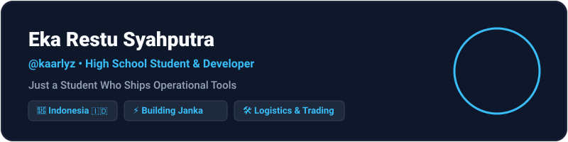
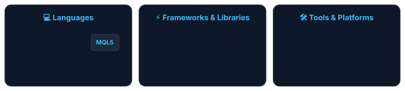

<p align="center">
  
</p>

<p align="center">
  
</p>

<p align="center">
  
</p>

<p align="center">
   &nbsp;•&nbsp;
  <span>📍 Indonesia 🇮🇩</span> &nbsp;•&nbsp;
  <span>🎓 High School Student &amp; Builder</span>
</p>

<p align="center">
  
</p>

<!-- Anchor Nav Pills -->
<p align="center">
  <a href="#-about-me"></a> &nbsp;
  <a href="#-currently-building--technical-focus"></a> &nbsp;
  <a href="#-featured-engineering-projects"></a> &nbsp;
  <a href="#-tech-stack--skills-matrix"></a> &nbsp;
  <a href="#-activity--contribution-snake"></a>
</p>

<p align="center">
  
</p>

## 👤 About Me

Hey, I'm **Eka Restu Syahputra** (`@kaarlyz` / `Kaaaxyws`), an ambitious **high school student & developer from Indonesia** 🇮🇩.

I don't collect technology badges or pretend to be an enterprise CTO. Instead, I build practical tools to solve real operational friction, automate repetitive tasks, and understand systems from the ground up.

```
learn  ─►  build  ─►  break  ─►  debug  ─►  understand  ─►  improve
```

* **Engineering Mindset**: Practical engineering > hype. AI tools are productivity multipliers for acceleration, not a replacement for code comprehension and core fundamentals.
* **Growth Trajectory**: Applied this disciplined engineering loop to my academics, moving my high school class ranking consistently from **11th ➔ 8th ➔ 7th ➔ 5th**.
* **Principles**: Build first, understand deep; automate repetitive work; detail-obsessed UI/UX; zero unnecessary complexity.

<p align="center">
  
</p>

## 🔨 Currently Building & Technical Focus

* **📦 [Janka](https://github.com/kaarlyz/janka) (Logistics Petty Cash System)**: Refining multi-worksheet ExcelJS export formatting, 6-column `KAS REGULER` layout alignment, and J&T XLSX nightly reconciliation engine accuracy.
* **📊 [KAFX Journal](https://github.com/kaarlyz/myfxjournal) (Trading Analytics Engine)**: Optimizing backtest tick replay precision and MQL5 MetaTrader 5 trade execution sync latency.
* **🤖 [RemiBot](https://github.com/kaarlyz/remibot) (WhatsApp Automation Core)**: Strengthening Baileys socket queue stability and modular plugin permission middleware.

<p align="center">
  
</p>

## 🚀 Featured Engineering Projects

<p align="center">
  <a href="https://github.com/kaarlyz/janka">
    
  </a>
</p>

<table>
  <tr>
    <td width="340" valign="top">
      
    </td>
    <td valign="top">
      <h3>📦 <a href="https://github.com/kaarlyz/janka">Janka</a> — Logistics Petty Cash &amp; Waybill System</h3>
      <p><i>REAL PROBLEM ➔ WORKFLOW ➔ TOOL ➔ AUTOMATION</i></p>
      <p>Desktop web application built to solve physical warehouse intake and shipping paperwork bottlenecks.</p>
      <ul>
        <li><b>Thermal Shipping Labels</b>: 100x150mm label renderer with SVG barcode pattern generation for instant printing.</li>
        <li><b>Nightly Reconciliation Engine</b>: Automated J&amp;T XLSX report parser matching waybill IDs against local records.</li>
        <li><b>Audit-Ready Excel Exporter</b>: Multi-worksheet monthly Excel exporter (<code>KAS REGULER</code>) with native <code>=SUM()</code> formulas, <code>Rp</code>/<code>kg</code> cell formatting, and landscape print setups.</li>
      </ul>
      <p><b>Stack</b>: <code>TypeScript</code> • <code>React 18</code> • <code>Vite 5</code> • <code>Tailwind CSS 3</code> • <code>ExcelJS</code> • <code>SheetJS (xlsx)</code></p>
    </td>
  </tr>
</table>

<br />

<p align="center">
  <a href="https://github.com/kaarlyz/myfxjournal">
    
  </a>
</p>

<table>
  <tr>
    <td width="340" valign="top">
      
    </td>
    <td valign="top">
      <h3>📊 <a href="https://github.com/kaarlyz/myfxjournal">KAFX Journal</a> — Quantitative Trading Journal &amp; Analytics</h3>
      <p><i>FINANCIAL PROTOCOL &amp; DATA ANALYTICS EXPERIMENTATION</i></p>
      <p>Financial data analytics platform and backtesting replay tool engineered to track and audit market execution strategies.</p>
      <ul>
        <li><b>MT5 Expert Advisor Bridge</b>: Automated trade execution data syncing between MetaTrader 5 terminal and local database.</li>
        <li><b>Backtest Replay Engine</b>: Interactive chart replay system for evaluating historical trade setups.</li>
        <li><b>Risk/Reward Analytics</b>: Statistical win-rate, expectancy, and draw-down metrics visualizations.</li>
      </ul>
      <p><b>Stack</b>: <code>TypeScript</code> (2.8MB) • <code>MQL5</code> (260KB) • <code>Python</code> • <code>Chart.js</code></p>
    </td>
  </tr>
</table>

<br />

### 🤖 [RemiBot](https://github.com/kaarlyz/remibot) — *Modular WhatsApp Automation Engine*
> **MESSAGING AUTOMATION & WORKFLOW QUEUE**

A modular Node.js WhatsApp automation bot built on top of the Baileys socket library for handling structured messaging workflows.

* **Core Stack**: `JavaScript` (Node.js), `Baileys (WA Web Socket API)`
* **Key Features**: Plugin permission architecture, persistent broadcast queue, and automated school announcements.

---

### ⚡ [Particle-Shape-Gesture](https://github.com/kaarlyz/Particle-shape-gesture) — *Computer Vision Gesture Interaction*
> **EXPERIMENTAL HARDWARE & VISION INTERACTION**

An experimental Python computer vision project mapping real-time hand gesture tracking to dynamic particle shape simulations (`Python`, `OpenCV`).

---

### 🌐 [myporto](https://github.com/kaarlyz/myporto) & [servicewebsite](https://github.com/kaarlyz/servicewebsite)
Personal web showcase and client agency website templates built with clean CSS & TypeScript.

<p align="center">
  
</p>

## 🛠️ Tech Stack & Skills Matrix

<p align="center">
  
</p>

<p align="center">
  <a href="https://skillicons.dev">
    
  </a>
</p>

<p align="center">
  
</p>

<details>
  <summary><b>🔍 Detailed Tech Matrix &amp; Learning Focus</b></summary>
  <br />
  <ul>
    <li><b>Core Web Engineering</b>: TypeScript, JavaScript, React 18, Tailwind CSS 3, Vite 5</li>
    <li><b>Backend &amp; Scripting</b>: Node.js, Python, MQL5 (MetaTrader 5 Integration)</li>
    <li><b>Data &amp; File Systems</b>: ExcelJS, SheetJS <code>xlsx</code>, LocalStorage / Web Storage</li>
    <li><b>Automation &amp; Integrations</b>: Baileys (WA Web Socket API), REST APIs, Git &amp; GitHub Actions</li>
    <li><b>Currently Learning Focus</b>: Backend fundamentals, cybersecurity basics, system design architecture.</li>
    <li><b>Dev Mindset</b>: AI-assisted development (Copilot &amp; LLMs as multipliers grounded in manual code comprehension &amp; debugging).</li>
  </ul>
</details>

<p align="center">
  
</p>

## 📈 Activity & Contribution Snake

<p align="center">
  <picture>
    <source media="(prefers-color-scheme: dark)" srcset="https://raw.githubusercontent.com/kaarlyz/kaarlyz/output/github-contribution-grid-snake-dark.svg" />
    <source media="(prefers-color-scheme: light)" srcset="https://raw.githubusercontent.com/kaarlyz/kaarlyz/output/github-contribution-grid-snake.svg" />
    
  </picture>
</p>

<p align="center">
  
  &nbsp;
  
</p>

<p align="center">
  <i>"Build first, debug deep, and automate the mundane."</i><br />
  <b>Eka Restu Syahputra (@kaarlyz)</b>
</p>

<p align="center">
  
</p>
