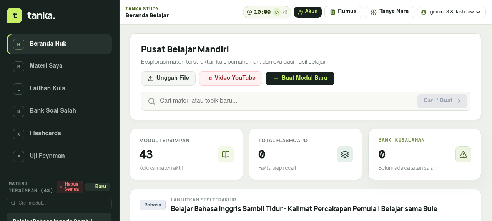
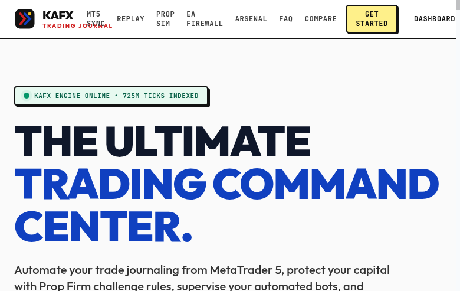
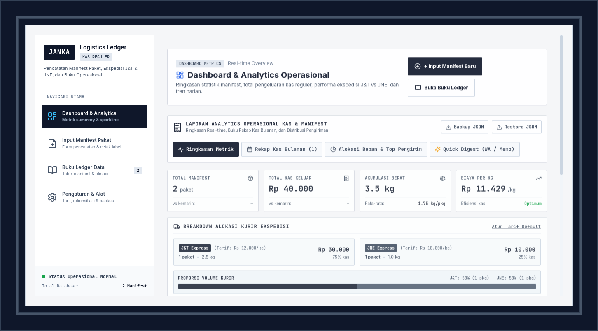

<div align="center">

  <!-- Header Banner -->
  

  <!-- Dynamic Typing Subtitle -->
  <a href="https://github.com/kaarlyz">
    
  </a>

  <!-- Profile Identity Card -->
  <table border="0" style="border: none; background: transparent; margin-top: 10px;">
    <tr style="border: none; background: transparent;">
      <td align="center" width="200" valign="middle" style="border: none;">
        
      </td>
      <td valign="middle" align="left" style="border: none; padding-left: 18px;">
        <h2 style="margin: 0; padding: 0; color: #f8fafc; font-size: 26px;">Eka Restu Syahputra 👋</h2>
        <p style="margin: 4px 0 10px 0; color: #38bdf8; font-family: monospace; font-weight: 600;">
          @kaarlyz • High School Senior &amp; Systems Builder
        </p>
        <p style="margin: 0 0 10px 0; color: #94a3b8; font-size: 13.5px; line-height: 1.5;">
          <i>"The cost of failing at 17 is Rp0. Grind the skills, build the proof of work, and let the code speak for itself."</i>
        </p>
        <p style="margin: 0;">
          
          
          
          
        </p>
      </td>
    </tr>
  </table>

  <!-- Aesthetic Anime Banner -->
  <p align="center" style="margin-top: 15px;">
    
  </p>

</div>

---

### ⚡ About Me

```bash
$ cat ~/.profile
```

Hey, I'm **Eka Restu Syahputra** (`@kaarlyz`). I am a 17-year-old student developer, class president, and software builder based in Indonesia. 

I don't build generic clone tutorials—I build functional, production-grade tools designed to solve real friction, automate repetitive workflows, and explore software architecture from the metal up.

* 🎓 **Academic**: High School Senior (SMA Negeri, Class of 2027) & Class President (XII-6).
* 🛠️ **Builder Stance**: Firm believer in **Learn $\rightarrow$ Earn $\rightarrow$ Own**. Value is created by shipping authentic *proof of work*, not chasing speculative hype.
* 🖥️ **Workspace**: **Arch Linux** on GNOME Wayland (customized tiling workflow, Blackbox Terminal, Zsh + Starship prompt, FiraCode Nerd Font).
* 🧪 **Engineering Focus**: Autonomous multi-stage AI pipelines, local-first SQLite WAL storage, and distraction-free cognitive learning engines.

```
[ Understand Friction ] ──► [ Prototype Solution ] ──► [ Stress-Test ] ──► [ Ship Artifact ]
```

---

### 🚀 Featured Engineering Portfolio

<table>
  <!-- PROJECT 1: TANKA -->
  <tr>
    <td width="360" valign="top">
      <a href="https://github.com/kaarlyz/Tanka">
        
      </a>
      <p align="center" style="margin-top: 6px;">
        <a href="https://github.com/kaarlyz/Tanka">
          
        </a>
        
      </p>
    </td>
    <td valign="top">
      <h3>🧠 <a href="https://github.com/kaarlyz/Tanka">Tanka (短歌)</a></h3>
      <p><i>Autonomous Adaptive Cognitive Study Platform &amp; High-Retention Engine</i></p>
      <p>An editorial-grade learning companion transforming textbooks, handwritten exam notes, PDFs, and YouTube videos into structured mastery systems.</p>
      <ul>
        <li><b>Two-Pass V3 Pipeline:</b> Grounded national curriculum verification (Ruangguru/Wikipedia) + canonical concept maps.</li>
        <li><b>Adaptive Domain Engine:</b> Automatic separation between academic exact sciences (KaTeX equations, UTBK worked examples) and practical growth playbooks.</li>
        <li><b>Active Recall Ecosystem:</b> Micro-batched HOTS quizzes (up to 20 questions), hidden formula cards, and spaced repetition Leitner flashcards.</li>
        <li><b>Tanya Nara AI Tutor:</b> Session-isolated conversational mentor with 2-layer persistence (localStorage + SQLite) &amp; 9Router token-saver bypass.</li>
      </ul>
      <p>
        <code>React 18</code> • <code>TypeScript</code> • <code>Node.js (Raw HTTP)</code> • <code>SQLite (WAL)</code> • <code>KaTeX</code> • <code>PWA</code> • <code>Python</code>
      </p>
    </td>
  </tr>

  <!-- PROJECT 2: KAFX JOURNAL -->
  <tr>
    <td width="360" valign="top">
      <a href="https://github.com/kaarlyz/myfxjournal">
        
      </a>
      <p align="center" style="margin-top: 6px;">
        <a href="https://github.com/kaarlyz/myfxjournal">
          
        </a>
        
      </p>
    </td>
    <td valign="top">
      <h3>📊 <a href="https://github.com/kaarlyz/myfxjournal">KAFX Journal</a></h3>
      <p><i>Quantitative Trading Analytics, Risk Audit &amp; Replay Engine</i></p>
      <p>A specialized trading performance auditor and backtesting platform built to enforce disciplined risk-to-reward ratios and track psychological execution biases.</p>
      <ul>
        <li><b>Trade Execution Auditing:</b> Granular R:R distribution, win/loss clustering, and drawdown tracking.</li>
        <li><b>Replay Backtesting:</b> Candle-by-candle market replay environment for strategy verification without financial exposure.</li>
        <li><b>MetaTrader 5 Bridge:</b> Expert Advisor syncing execution data directly into the analytical dashboard.</li>
      </ul>
      <p>
        <code>TypeScript</code> • <code>React</code> • <code>Node.js</code> • <code>Python</code> • <code>MQL5</code>
      </p>
    </td>
  </tr>

  <!-- PROJECT 3: JANKA LOGISTICS -->
  <tr>
    <td width="360" valign="top">
      <a href="https://github.com/kaarlyz/janka">
        
      </a>
      <p align="center" style="margin-top: 6px;">
        <a href="https://github.com/kaarlyz/janka">
          
        </a>
        
      </p>
    </td>
    <td valign="top">
      <h3>📦 <a href="https://github.com/kaarlyz/janka">Janka</a></h3>
      <p><i>Logistics Petty Cash &amp; Thermal Waybill System</i></p>
      <p>Warehouse operational dashboard built to solve shipping paperwork friction and manual manifest reconciliation.</p>
      <ul>
        <li><b>Thermal Label Rendering:</b> Instant client-side shipping label generation ready for 100x150mm thermal printers.</li>
        <li><b>Nightly Reconciliation:</b> Automated Excel XLSX reconciliation engine with audit-ready transaction ledgers.</li>
      </ul>
      <p>
        <code>TypeScript</code> • <code>React</code> • <code>Vite</code> • <code>ExcelJS</code> • <code>Tailwind CSS</code>
      </p>
    </td>
  </tr>

  <!-- PROJECT 4: AETHERPARTICLES 3D -->
  <tr>
    <td width="360" valign="top">
      <a href="https://github.com/kaarlyz/Particle-shape-gesture">
        
      </a>
      <p align="center" style="margin-top: 6px;">
        <a href="https://github.com/kaarlyz/Particle-shape-gesture">
          
        </a>
        
      </p>
    </td>
    <td valign="top">
      <h3>🌌 <a href="https://github.com/kaarlyz/Particle-shape-gesture">AetherParticles 3D</a></h3>
      <p><i>Real-Time AI Hand-Tracked 3D Particle Motion Engine</i></p>
      <p>Interactive computer vision engine rendering 12,000 high-density 3D particles controlled purely via webcam hand gestures in real time.</p>
      <ul>
        <li><b>Vectorized Physics Engine:</b> NumPy-accelerated particle physics running at smooth 60 FPS.</li>
        <li><b>Multi-Modal Hand Tracking:</b> Google MediaPipe Tasks API with 3D rotation-invariant distance vector classification.</li>
        <li><b>8 Volumetric Formations:</b> 3D Heart, Saturn Orbit, Quad-Arm Galaxy Spiral, Spiderman Mask, and Gravitational Singularity.</li>
      </ul>
      <p>
        <code>Python 3</code> • <code>Google MediaPipe</code> • <code>NumPy</code> • <code>Pygame</code> • <code>Computer Vision</code>
      </p>
    </td>
  </tr>

  <!-- PROJECT 5: 9ROUTER COMMAND HUB -->
  <tr>
    <td width="360" valign="top">
      <a href="https://github.com/kaarlyz/nanonanabot">
        
      </a>
      <p align="center" style="margin-top: 6px;">
        <a href="https://github.com/kaarlyz/nanonanabot">
          
        </a>
        
      </p>
    </td>
    <td valign="top">
      <h3>⚡ <a href="https://github.com/kaarlyz/nanonanabot">9Router Command Hub</a></h3>
      <p><i>Enterprise Multi-Account AI Model Gateway &amp; Telegram Orchestrator</i></p>
      <p>Mission-control bot for monitoring, quota load-balancing, and orchestrating multi-account LLM gateway nodes over 9Router.</p>
      <ul>
        <li>Real-time telemetry, model cooldown management, and round-robin quota rotation.</li>
        <li>Autonomous execution hooks for developer CLI engines and token-saver bypass handlers.</li>
      </ul>
      <p>
        <code>Node.js</code> • <code>Telegram Bot API</code> • <code>9Router</code> • <code>REST API</code>
      </p>
    </td>
  </tr>

  <!-- PROJECT 6: HOPDIS -->
  <tr>
    <td width="360" valign="top">
      <a href="https://github.com/kaarlyz/HOPDIS">
        
      </a>
      <p align="center" style="margin-top: 6px;">
        <a href="https://github.com/kaarlyz/HOPDIS">
          
        </a>
        
      </p>
    </td>
    <td valign="top">
      <h3>🚀 <a href="https://github.com/kaarlyz/HOPDIS">HOPDIS</a></h3>
      <p><i>Universal Linux &amp; Windows-to-Linux Zero-ReLogin Session Migrator</i></p>
      <p>Automated migration CLI for Linux distro-hoppers and Windows switchers preserving active browser sessions and developer environments.</p>
      <ul>
        <li><b>Zero-ReLogin:</b> Telegram Desktop (<code>tdata</code>), Chrome, Firefox, Discord, and SSH sessions stay authenticated without re-scanning QR/OTPs.</li>
        <li><b>AI Stack Ready:</b> Automated backup/restore for Hermes Agent, 9Router, Cursor, and Ollama configs.</li>
      </ul>
      <p>
        <code>Bash</code> • <code>PowerShell</code> • <code>Linux (Arch / Debian / Fedora)</code> • <code>Rclone</code>
      </p>
    </td>
  </tr>
</table>

#### 🔍 Additional Engineering Experiments:
* **📈 [MCP-TradingView](https://github.com/kaarlyz/MCP-TRADINGVIEW)**: Model Context Protocol server enabling autonomous AI agents to drive TradingView Desktop charts via Chrome DevTools Protocol (CDP). `Node.js` • `MCP` • `CDP`
* **🤖 [RemiBot](https://github.com/kaarlyz/remibot)**: Modular WhatsApp automation bot on Baileys socket library for handling structured messaging workflows and broadcast queues. `JavaScript` • `Baileys WA Socket`
* **☕ [MyCoffee](https://github.com/kaarlyz/mycoffee)**: Interactive modern coffee ordering and cafe storefront experiment built with Next.js and TypeScript.

---

### 🛠️ Tech Arsenal & Systems

<p align="center">
  <a href="https://skillicons.dev">
    
  </a>
</p>

<table width="100%">
  <tr>
    <td width="33%" valign="top">
      <b>Frontend &amp; Experience</b>
      <ul>
        <li>TypeScript / JavaScript (ESNext)</li>
        <li>React 18 / 19, Vite, Tailwind CSS</li>
        <li>KaTeX Mathematical Typesetting</li>
        <li>Progressive Web Apps (PWA)</li>
        <li>Editorial Anti-Slop Design Systems</li>
      </ul>
    </td>
    <td width="33%" valign="top">
      <b>Backend &amp; Core Systems</b>
      <ul>
        <li>Node.js (Native HTTP / Express)</li>
        <li>Python 3.14 (Fast Scripting via <code>uv</code>)</li>
        <li>SQLite (WAL-Mode, <code>better-sqlite3</code>)</li>
        <li>Bash Scripting &amp; Linux CLI Automation</li>
        <li>WebSockets &amp; Protocol Buffers</li>
      </ul>
    </td>
    <td width="33%" valign="top">
      <b>AI, Tooling &amp; Environment</b>
      <ul>
        <li>9Router Gateway &amp; LLM Orchestration</li>
        <li>Model Context Protocol (MCP) &amp; CDP</li>
        <li>Arch Linux (GNOME Wayland, Zsh)</li>
        <li>Git, Neovim, Blackbox Terminal</li>
        <li>Obsidian Vault (Growth &amp; Life Tracking)</li>
      </ul>
    </td>
  </tr>
</table>

---

### 📊 GitHub Activity & Metrics

<div align="center">
  <table border="0" style="border: none; background: transparent;">
    <tr style="border: none; background: transparent;">
      <td align="center" valign="middle" style="border: none;">
        
      </td>
      <td align="center" valign="middle" style="border: none;">
        
      </td>
    </tr>
  </table>

  <!-- Contribution Snake Animation -->
  <p align="center" style="margin-top: 10px;">
    <picture>
      <source media="(prefers-color-scheme: dark)" srcset="https://raw.githubusercontent.com/kaarlyz/kaarlyz/output/github-contribution-grid-snake-dark.svg" />
      <source media="(prefers-color-scheme: light)" srcset="https://raw.githubusercontent.com/kaarlyz/kaarlyz/output/github-contribution-grid-snake.svg" />
      
    </picture>
  </p>
</div>

---

<div align="center">
  <p style="color: #94a3b8; font-size: 13.5px;">
    <i>"Tatakae. Keep moving forward until the artifact is built."</i>
  </p>
  <p>
    <a href="https://github.com/kaarlyz">
      
    </a>
  </p>
</div>