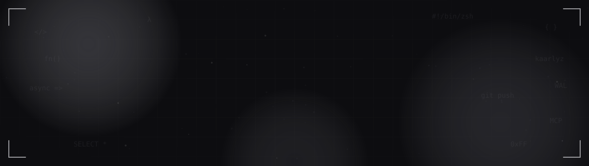
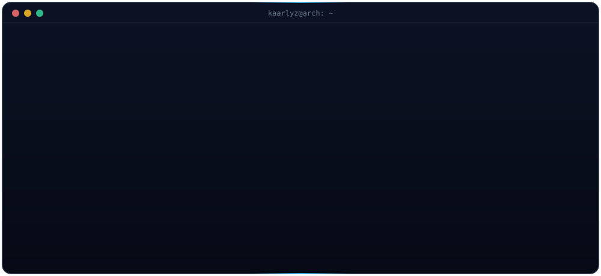
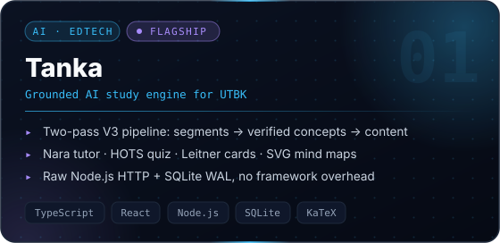
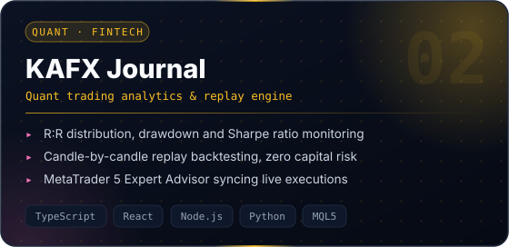
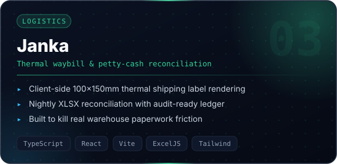
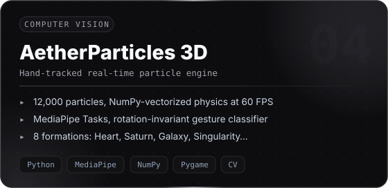
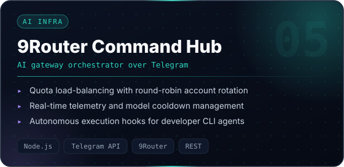
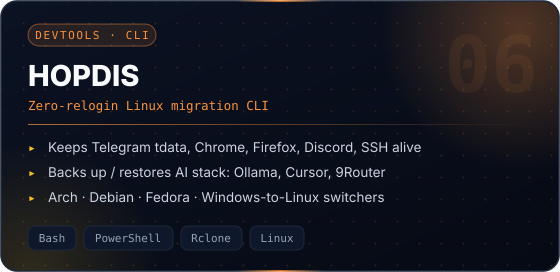
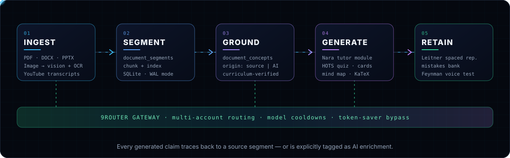
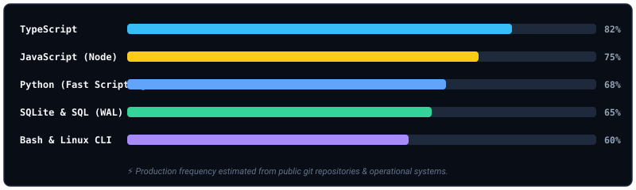

<table border="0" style="border: none; background: transparent; margin: 6px 0 12px 0;">
  <tr style="border: none; background: transparent;">
    <td align="center" width="130" valign="middle" style="border: none;">
      
    </td>
    <td valign="middle" align="left" style="border: none; padding-left: 16px;">
      

        Eka Restu Syahputra 👋 @kaarlyz
      

      

        <i>"The cost of failing at 17 is Rp0. Eliminate speculative noise, master first principles, build proof of work, and let the code speak."</i>
      

      

        
        
        
        
      

    </td>
  </tr>
</table>

  <a href="#work"><b>Work</b></a> &nbsp;/&nbsp;
  <a href="#tanka"><b>Tanka</b></a> &nbsp;/&nbsp;
  <a href="#stack"><b>Stack</b></a> &nbsp;/&nbsp;
  <a href="#principles"><b>Principles</b></a> &nbsp;/&nbsp;
  <a href="#telemetry"><b>Telemetry</b></a>

 

  

 

> **I build systems that run in production, not demos.** Autonomous AI pipelines, local-first data layers, and fast interfaces. Every project below started as a real operational friction and ended as a working artifact.

 

  
  
  
  
  
  

<b>Interface previews</b>

 

  
  
  

**Experiments**

- **[MCP-TradingView](https://github.com/kaarlyz/MCP-TRADINGVIEW)**: Model Context Protocol server that lets AI coding agents inspect and control TradingView Desktop natively through Chrome DevTools Protocol. `TypeScript` `Node.js` `MCP` `CDP`
- **[RemiBot](https://github.com/kaarlyz/remibot)**: modular WhatsApp automation on the Baileys WebSocket library, built around structured workflows and broadcast queues. `JavaScript` `Baileys`
- **[MyCoffee](https://github.com/kaarlyz/mycoffee)**: coffee ordering storefront experiment. `Next.js` `TypeScript`

 

**Tanka (短歌)** is an adaptive study platform that turns textbooks, handwritten notes, PDFs, and YouTube videos into a structured mastery system for Indonesian SMA/UTBK students. The core design rule: **generation must be grounded.** Facts are extracted and verified first, and only then synthesized into teaching material.

  

**Engineering problems solved**

| Problem | Approach |
|:--|:--|
| Model hallucination in study material | Two-Pass V3 pipeline: Pass 1 extracts canonical facts, Pass 2 does adaptive pedagogical synthesis. Concepts carry an origin tag (`source` or `ai_enrichment`) and are checked against the national curriculum (Ruangguru / Wikipedia) |
| OCR timeouts on large handwritten scans | Client-side HTML5 canvas compression with dynamic sizing, plus parallel multi-worker AI OCR to stay under HTTP / Cloudflare timeout limits |
| Complex math rendering | KaTeX typesetting with HTML tag isolation so expressions survive generation and sanitizing |
| Source diversity | Unified ingestion: `pdftotext`, Tesseract, PPTX/DOCX XML parsing, vision API for images, multilingual YouTube transcript extractor |
| Tutor context bleeding between documents | "Tanya Nara" with per-document session isolation and two-layer persistence (localStorage + SQLite) |
| Retention, not just reading | HOTS quizzes micro-batched up to 20 questions, hidden formula cards, Leitner spaced-repetition flashcards, mistakes bank, Feynman voice test (`MediaRecorder` to `faster-whisper`) |
| Token cost and rate limits | 9Router gateway with custom-header token-saver bypass, model cooldown handling, and per-domain adaptive temperature |
| Speed and offline resilience | PWA with service-worker caching, native Node.js HTTP server (no Express), in-process SQLite in WAL mode with cascading deletes |

* **Adaptive domains:** Exact sciences get KaTeX equations and UTBK-style worked examples; practical topics get playbook-style output.
* **Continuously audited:** Prompts, context truncation, tone consistency, mobile table/diagram rendering, and OCR typo correction are stress-tested on real study material rather than assumed to work.

 

  

  

| Category | Systems & Technologies |
|:--|:--|
| **Frontend and UX systems** | `TypeScript` • `React 18/19` • `Vite` • `Tailwind CSS` • `KaTeX Typesetting` • `PWA & Service Workers` • `Editorial Anti-Slop UI` |
| **Backend and data layer** | `Node.js (Native HTTP)` • `Express` • `Python 3.14 (uv)` • `SQLite (WAL-Mode, better-sqlite3)` • `WebSockets` • `Protocol Buffers` • `ExcelJS` |
| **AI engineering** | `Two-Pass V3 Grounded Pipelines` • `Vision OCR Parallel Workers` • `MCP & CDP Control` • `9Router Gateway & Header Bypass` • `faster-whisper` • `MediaPipe Tasks` |
| **Quant, vision and systems** | `R:R Distribution & Sharpe Auditing` • `MQL5 Expert Advisors` • `NumPy Vectorized Physics` • `Arch Linux (Zen, GNOME Wayland)` • `Bash & Zsh Automation` • `Rclone` |

 

- **Proof of work over claims.** A working artifact beats a certificate or a slide.
- **Grounded over fluent.** AI output must trace back to a source or be labeled as enrichment.
- **Local-first, low-dependency.** Native HTTP and in-process SQLite: fewer moving parts, zero network latency to the data layer, easier to debug and ship.
- **Plan, then execute fast.** Define the concrete steps first, then move without ceremony.
- **Audit your own pipeline.** Prompts, context limits, tone drift, and OCR noise get tested, not assumed.
- **Design is engineering.** Clean editorial interfaces, no template slop, no visual clutter, instant interactions.

 

  
  

  

  <picture>
    <source media="(prefers-color-scheme: dark)" srcset="https://raw.githubusercontent.com/kaarlyz/kaarlyz/output/github-contribution-grid-snake-dark.svg" />
    <source media="(prefers-color-scheme: light)" srcset="https://raw.githubusercontent.com/kaarlyz/kaarlyz/output/github-contribution-grid-snake.svg" />
    
  </picture>

 

Open to talking architecture, AI pipelines, or building something together. Reach out through GitHub or Telegram.

 

